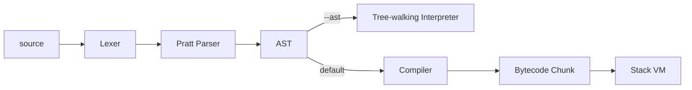

# Stackforge

A complete, small programming language: lexer → Pratt parser → **two independent backends** you can run the same program on — a tree-walking AST interpreter and a stack-based bytecode VM — so the performance difference between "interpret the tree directly" and "compile to bytecode first" is something you can actually measure, not just assert.

[](https://github.com/sfeirc/Stackforge-Lang/actions/workflows/ci.yml)

[](LICENSE)

## Why this matters

Building a complete language from scratch — a lexer, a Pratt parser, a tree-walking interpreter, and a stack-based bytecode VM you can benchmark against each other — is the same underlying skill set behind the internal DSLs nearly every serious engineering organization eventually needs: a rules DSL for a fraud-detection engine, a query language for an internal data platform, a policy/config language for infrastructure. That's directly relevant to tech/AI roles touching compilers and developer tooling, to quant/finance systems where a proprietary strategy or rules DSL often sits behind the trading logic, and to consulting engagements where a client's business rules get formalized into a small language of their own. This project isn't used in any of those settings — what it demonstrates is the mechanism: a genuine interpreter and a genuine compiler/VM pair, sharing one AST, verified to agree with each other exactly, and benchmarked against each other rather than just asserted to be "faster."

## The language

Variables, numbers/booleans/strings, arrays and hash maps, `if`/`else`, `while`, C-style `for`, functions with parameters and return values (full recursion, including mutual recursion), arithmetic/comparison/logical operators with correct precedence, and a `print` statement.

```
fn fib(n) {
    if (n < 2) { return n; }
    return fib(n - 1) + fib(n - 2);
}

for (let i = 0; i < 10; i = i + 1) {
    print fib(i);
}
```

More examples in `examples/`: `factorial.sf`, `accumulator.sf`, `mutual_recursion.sf`, `arrays_and_maps.sf`, `demo.sf` (runs all of them).

## Pipeline



- **Lexer** (`src/lexer.rs`): hand-written, tracks line numbers for error reporting, handles string escapes.
- **Parser** (`src/parser.rs`): Pratt (precedence-climbing) parsing for expressions, so `a + b * c` and `a < b && c` bind exactly the way you'd expect — verified by test, not just eyeballed.
- **Two backends sharing the same AST**:
  - `src/interpreter.rs` walks the AST directly.
  - `src/compiler.rs` compiles the AST to a `Chunk` of bytecode (`src/chunk.rs`); `src/vm.rs` is a stack machine that executes it (`PUSH`/`ADD`/`JUMP`/`CALL`/`RET`-style instructions with an explicit call stack for functions).

Run either with `stackforge --ast script.sf` or `stackforge --vm script.sf` (VM is the default).

## Verified correctness

- **Both backends are tested against each other**, not just independently: `tests/integration.rs` has `assert_both_backends_output` used across fibonacci, factorial, an accumulator loop, mutual recursion, and arrays/maps — the tree-walker and the VM must agree exactly on every one.
- **Error handling, not just happy paths**: a syntax error (missing semicolon) is checked to report the *correct line number* rather than panic; a runtime division-by-zero is checked to report the line of the division itself, not the call site; an out-of-bounds array index and an undefined variable are both handled errors, not crashes.
- **The classic stack-VM bug, checked explicitly**: `vm::tests::stack_is_balanced_after_a_full_program` asserts the operand stack returns to exactly its starting size after running a complete program — a stack leak (values never popped) is one of the most common bugs in a hand-written bytecode VM, and this test exists specifically to catch it.
- Lexer tests check exact token kinds/line numbers for representative inputs; parser tests check the actual precedence and associativity produced (including that `for` desugars correctly into an equivalent `while`-based block).

**46 tests** (36 unit + 10 integration), all passing.

## Benchmarks

Measured on this repo's own dev machine (shared 4-core Xeon E5-2683 v3 VM), Criterion, comparing the two backends on the identical program:

| Workload | Bytecode VM | AST Interpreter | VM speedup |
|---|---|---|---|
| Recursive `fib(25)` | 30.2 ms | 167.4 ms | **~5.5x** |
| Tight loop, 1,000,000 iterations | 195.5 ms | 693.0 ms | **~3.5x** |

(Each number includes lex+parse, which is common to both paths and roughly constant — the comparison is dominated by the execution strategy, not parsing.) Reproduce with `cargo bench --bench vm_bench`.

## Try it

```bash
cargo build --release
./target/release/stackforge examples/demo.sf
./target/release/stackforge --ast examples/fibonacci.sf   # force the tree-walking interpreter
```

Or with Docker:

```bash
docker build -t stackforge .
docker run --rm stackforge   # runs examples/demo.sf by default
```

## Honest scope — what this is *not*

- **No garbage collector.** Arrays/maps are reference-counted (`Rc<RefCell<...>>`); there's no cycle collector, so a self-referential structure would leak. Not a concern for straight-line/recursive programs like the examples here.
- **No static type system.** Everything is dynamically typed and checked at runtime (division by zero, wrong argument counts, etc. are runtime errors, not compile errors), matching languages like Python/Ruby rather than a statically-typed language.
- **Small instruction set / standard library.** A handful of built-ins (`src/builtins.rs`), no modules/imports, no string formatting beyond concatenation.

## A note on this repo's commit history

This repo's git history was reorganized after the fact into feature-scoped commits (lexer → parser → interpreter → compiler → VM → tests → CI → docs) for readability. The code and the calendar date of development are authentic; the commit-by-commit timestamps and granularity were reconstructed to reflect the real build order, not recorded as they happened.

## License

MIT — see [LICENSE](LICENSE).
